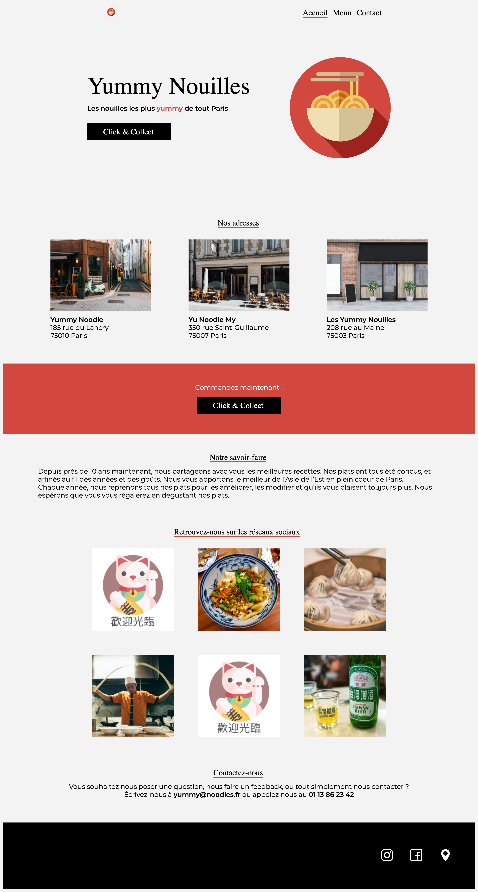

# Yummy Nouilles


Bienvenue sur le projet **Yummy Nouilles**, un site web dédié à promouvoir et gérer les restaurants de nouilles les plus délicieux de Paris. Ce site permet aux utilisateurs de découvrir le menu, de trouver les adresses des différents restaurants, et de contacter Yummy Nouilles pour des commandes et des informations supplémentaires.

## Table des Matières

- [Description du Projet](#description-du-projet)
- [Technologies Utilisées](#technologies-utilisées)
- [Installation](#installation)
- [Utilisation](#utilisation)
- [Structure du Projet](#structure-du-projet)
- [Optimisations SEO](#optimisations-seo)
- [Déploiement](#déploiement)
- [Contribution](#contribution)
- [Licence](#licence)
- [Contact](#contact)
- [Remerciements](#remerciements)

## Description du Projet

L'objectif principal de ce projet est de fournir une présence en ligne attrayante et fonctionnelle pour **Yummy Nouilles**, un réseau de restaurants de nouilles à Paris. Le site inclut les fonctionnalités suivantes :

- **Accueil** : Présentation de Yummy Nouilles avec une bannière attrayante et un appel à l'action pour commander.
- **Menu** : Liste détaillée des entrées et des plats disponibles dans les restaurants.
- **Contact** : Informations de contact et adresses des différents établissements.
- **Responsive Design** : Adaptabilité sur tous les types d'appareils (ordinateurs, tablettes, mobiles).
- **Optimisations SEO** : Améliorations pour une meilleure visibilité sur les moteurs de recherche.
- **Accessibilité** : Conformité aux standards WCAG pour une meilleure accessibilité.
- **Performance Optimisée** : Vitesse de chargement rapide grâce à l'optimisation des ressources.
- **Sécurité** : Mise en place de bonnes pratiques de sécurité pour protéger les données utilisateurs.

## Technologies Utilisées

- **Frontend** :
  - HTML5 : Structure des pages web.
  - CSS3 : Stylisation et mise en page.
  - JavaScript : Interactivité et fonctionnalités dynamiques.
- **Outils de Développement** :
  - Visual Studio Code : Éditeur de code.
  - Git : Gestion de version.
  - GitHub : Hébergement du code source.
- **Outils SEO** :
  - Google Analytics : Suivi des performances du site.
  - Google Search Console : Gestion de la présence du site dans les résultats de recherche.
- **Design** :
  - Figma : Conception des maquettes et prototypes.

## Installation

### Prérequis

- **Navigateur Web** : Chrome, Firefox, Safari, Edge.
- **Éditeur de Code** : Visual Studio Code ou tout autre éditeur de votre choix.
- **Git** : Pour cloner le dépôt.

### Étapes d'Installation

1. **Cloner le dépôt :**
   ```bash
   git clone https://github.com/zaaine/Yummy-Nouilles.git
   ```


